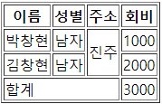

# 표 만들기(Table)

```html
<html>
<body>
	<td>이름</td> <td>성별</td> <td>주소</td>
	<td>박창현</td> <td>남자</td> <td>진주</td>
</body>
</html>
```

- td : table data. 테이블을 표현하는 항목 하나하나를 표시한다.


```html
<html>
<body>
<table border="1">
    <tr>
        <td>이름</td> <td>성별</td> <td>주소</td>
    </tr>
    <tr>
        <td>박창현</td> <td>남자</td> <td>진주</td>
    </tr>
    <tr>
        <td>김창현</td> <td>남자</td> <td>진주</td>
    </tr>
</table>
</body>
</html>
```

- tr: table row. 같은 행에 속하는 td를 묶어서 행을 표시한다.

- table : table 태그로 묶어줘야 행을 표시한다.
  - border : 테두리를 표시하는 속성.

- 웹 페이지의 레이아웃을 잡을 때, 과거의 방식은 웹 페이지 전체를 표로 잡아서 만들었다.

- css를 통해서 만들자. 


```html
<html>
<body>
<table border="1">
    <thead>
        <tr>
            <th>이름</th> <th>성별</th> <th>주소</th> <th>회비</th>
        </tr>
    </thead>
    <tbody>
        <tr>
            <td>박창현</td> <td>남자</td> <td>진주</td> <td>1000</td>
        </tr>
        <tr>
            <td>김창현</td> <td>남자</td> <td>진주</td> <td>2000</td>
        </tr>
    </tbody>
    <tfoot>
        <tr>
            <td>합계</td> <td></td> <td></td> <td>3000</td>
        </tr>
    </tfoot>
</table>
</body>
</html>
```

- 테이블을 태그를 이용해서 의미론적으로 표현할 수 있다. 

- thead : 표의 상단
- tbody : 표의 내용
- tfoot : 표의 하단

- th : 표 상단의 셀 하나하나를 표시.


```html
<html>
<body>
<table border="1">
    <thead>
    <tr>
        <th>이름</th> <th>성별</th> <th>주소</th> <th>회비</th>
    </tr>
    </thead>
    <tbody>
    <tr>
        <td>박창현</td> <td>남자</td> <td rowspan="2">진주</td> <td>1000</td>
    </tr>
    <tr>
        <td>김창현</td> <td>남자</td> <td>2000</td>
    </tr>
    </tbody>
    <tfoot>
        <tr>
            <td colspan="3">합계</td>  <td>3000</td>
        </tr>
    </tfoot>
</table>
</body>
</html>
```

- 수직 병합을 하기 위해서
  - 병합하고자하는 첫 번째 셀에 속성을 추가하고 아래 셀은 삭제한다. 
    - rowspan="2" : 2개의 행이 병합된다.

- 수평 병합을 하기 위해서
  - 병합하고자 하는 첫 번째 셀에 속성을 추가하고 나머지 셀은 삭제한다.
    - colspan="3" : 3개의 컬럼이 병합된다.

