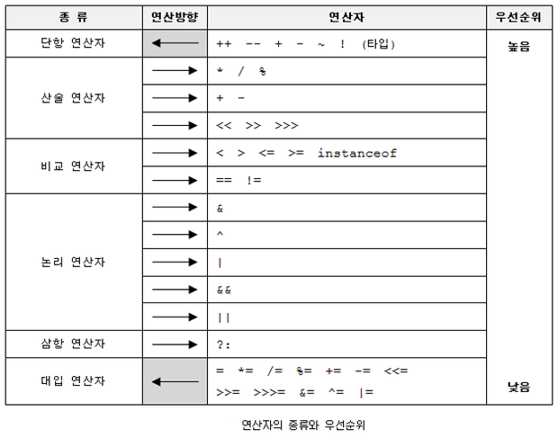

1. 연산자(Operator)

- 피연산자(operand) : 연산에 사용되는 값.
- 연산자(operator): 항을 이용하여 연산하는 기호.



```pseudocode
산술 > 비교 > 논리 > 대입. 대입이 제일 마지막에 수행된다.
단항(1) > 이항(2) > 삼항(3).
단항, 대입 연산자를 제외하면 모든 연산의 방향은 왼쪽에서 오른쪽이다.
```


2. 단항 연산자

2-1. 증감 연산자 ++, --

- 증감 연산자는 피연산자의 양쪽 모두에 위치 가능하다. 전위형(++a), 후위형(a++).
- boolean형을 제외한 모든 primitive pyte에서 사용가능 하다.

```java
public class Operator {

	public static void main(String[] args) {
		int a = 1;
		int b = 1;

		b = a++;
		System.out.println("a=" + a + " " + "b=" + b);

		a = 1;
		b = 1;
		b = ++a;
		System.out.println("a=" + a + " " + "b=" + b);
	}
}


a=2 b=1
a=2 b=2
```

* ++i 와 i= i+1의 결과는 서로 같지만, ++i가 더 빠르다.


2-2. 부호 연산자 +, -

- 부호 연산자는 피연산자의 부호를 변경하는데 사용한다.
- boolean형과 char형을 제외한 primitive type에서 사용가능 하다.

```java
public class Operator {
	public static void main(String[] args) {
		int a = 1;
		int b = 1;

		a = +a;
		b = -b;
		System.out.println("a=" + a + " " + "b=" + b);
	}
}

a=1 b=-1
```


2-3. 비트 전환 연산자 ~

- 정수형(byte, short, int. long)과 char형에서만 사용할 수 있다.
- 피연산자를 2진수로 표현했을 때, 0은 1로 1은 0으로 바꾼다.

```java
public class Operator {
	public static void main(String[] args) {
		byte a = 10;
		System.out.println("a = " + a);
		System.out.println("a = " + (~a));
		System.out.println("a = " + (~a + 1));
	}
}

a = 10
a = -11
a = -10
```

- 10을 -10으로 바꾸기 위해서는 1의보수를 취한 후 더하기 1을 하여 2의 보수로 만든다.

-  00001010 -> 11110101 -> 11110110

```java
public class Operator {
	public static void main(String[] args) {
		byte a = 10;
//비트 전환 연산자는 피연산자의 타입이 int형 보다 작으면, int형으로 변환한 다음 연산을 한다.
//		byte result = ~a; //~연산의 결과가 int형 이므로 byte 변수에 저장 불가능.
		byte result = (byte)~a;
		System.out.println("a = " + a);
		System.out.println("~a = " + result);
	}
}

a = 10
~a = -11
```


2-4. 논리부정 연산자 !

- boolean형에서만 사용할 수 있다.
- true는 false로 false는 true로 변경한다.

```java
public class Operator {
	public static void main(String[] args) {
		boolean flag = true;
		System.out.println(flag);
		flag = !flag;
		System.out.println(flag);
	}
}

true
false
```


3. 산술 연산자

- 산술 연산자는 모두 두개의 피연산자를 취하는 이항 연산자이다.
- 이항 연산자는 피연산자의 크기가 4byte 보다 작으면 4byte(int 형)로 변환한 다음, 연산을 수행 한다.


3-1. 사칙 연산자 +, -, *, /

```
1. int형보다 크기가 작은 경우 int형으로 형변환 후에 연산을 수행한다.
byte + short -> int + int -> int

2.두 개의 피연산자 중 자료형의 표현범위가 큰 쪽에 맞춰서 형변환 후에 연산을 수행한다.
int + float -> float + float -> float

3. 정수형 간의 나눗셈에서 0으로 나눌 수 없다.
```


3-2. 나머지 연산자 %

-  왼쪽의 피연산자를 오른쪽의 피연산자로 나누고 난 나머지의 값을 구하는 연산자이다.

- boolean형을 제외핮ㄴ 모든 기본형 변수에 사용할 수 있다.

```java
public class Operator {
	public static void main(String[] args) {
		for(int i = 1; i<10; i++) {
			if(i%3==0) {
				System.out.println(i);
			}
		}
	}
}

3
6
9
```


3-3. 쉬프트 연산자 <<, >>, >>>

- 정수형 변수에만 사용할 수 있다.
- 피연산자의 각 자리를 오른쪽 또는 왼쪽으로 n자리만큼 이동한다.

```pseudocode
x << n은 x * 2^n
x >> n은 x / 2^n

숫자 n의 값이 자료형의 bit수보다 크면, 자료형의 bit수로 나눈 나머지만큼 이동한다.
1000 >> 32는 아무런 일도 하지 않는다.
1000 >> 35는 1000 >> 3을 수행한다.
```

- "<<"는 부호에 상관없이 자리를 왼쪽으로 이동시키며 빈칸은 0으로 채운다.
- ">>"는 음수인 경우 부호를 유지시켜주기 위해서 빈자리를 1로 채우게 된다.
- ">>>"는 부호에 상관없이 빈자리를 무조건 0으로 채운다.

- ">>>"의 결과는 10진수 보다는 2진수로 표현했을 때, 기호로서 더 의미를 가지므로 비트연산에 주로 사용된다.

- 쉬프트 연산자를 사용하는 것이 사칙연산자보다 속도가 빠르다.

```java
public class Operator {
	public static void main(String[] args) {
	
		int tmp = 8;
		System.out.println(tmp);
		System.out.println(Integer.toBinaryString(tmp));
		
		tmp = 8<<1;
		System.out.println(tmp);
		System.out.println(Integer.toBinaryString(tmp));
		
		tmp = -8;
		System.out.println(tmp);
		System.out.println(Integer.toBinaryString(tmp));
		
		tmp = -8>>1;
		System.out.println(tmp);
		System.out.println(Integer.toBinaryString(tmp));
		
		tmp = -8 >>>1;
		System.out.println(tmp);
		System.out.println(Integer.toBinaryString(tmp));	
	}
}

8
1000
16
10000
-8
11111111111111111111111111111000
-4
11111111111111111111111111111100
2147483644
1111111111111111111111111111100
    
양수일 경우 앞에 0이 생략된것이다.
```


4. 비교 연산자

- 비교 연산자는 두개의 변수 또는 리터럴을 비교하는 데 사용된다.
- 연산의 결과는 true 또는 false이다.

4-1. 대소비교 연산자 <, >, <=, >=

- 기본형 중에서 boolean형을 제외한 자료형에서 모두 사용할 수 있다.
- 참조형에서는 사용할 수 없다.

4-2. 등가비교 연산자 !=, ==

- 두 피연산자에 저장되어 있는 값이 같은지 또는 다른지 비교하는 연산자이다.
- 기본형, 참조형에 모두 사용할 수 있다.
- 기본형은 변수에 저장된 값을 비교하고, 참조형의 경우 두 개의 피연산자(참조변수)가 같은 객체를 가리키고 있는지 알 수 있다.


5. 논리 연산자

5-1. 논리 연산자 &&, ||

- 논리 연산자는 피연산자가 boolean형 또는 boolean형 값을 결과로 하는 조건식에서만 사용할 수 있다.
- &&가 ||보다 우선순위가 높다.

| x     | y     | x \|\| y | x && y |
| ----- | ----- | -------- | ------ |
| true  | true  | true     | true   |
| true  | false | true     | false  |
| false | true  | true     | false  |
| false | false | false    | false  |

- 단락 회로 평가(short circuit evaluation)

  - 논리 곱(&&)은 두 항이 모두 true일 때만 결과가 true.

    => 앞의 항이 false이면 뒤 항의 결과를 평가하지 않아도 false.

  - 논리 합(||)은 두 항이 모두 false일 때만 결과가 false.

    => 앞의 항이 true이면 뒤 항의 결과를 평가하지 않아도 true.

  

5-2. 비트 연산자 - &, |, ^

- 이진 비트연산을 수행한다. 실수형을 제외한 모든 기본형에서 사용할 수 있다.

```pseudocode
&(AND 연산자) - 피연산자 양 쪽 값이 모두 1일 때만 1
|(OR 연산자) - 피연산자 중 한 쪽의 값이 1이면 1
^(XOR 연산자) - 피연산자의 값이 서로 다를 때만 1. 같으면 0
```

| x    | y    | x \| y | x & y | x ^ y |
| ---- | ---- | ------ | ----- | ----- |
| 1    | 1    | 1      | 1     | 0     |
| 1    | 0    | 1      | 0     | 1     |
| 0    | 1    | 1      | 0     | 1     |
| 0    | 0    | 0      | 0     | 0     |


6. 삼항연산자 ? :

- 조건식이 참이면 식1, 거짓이면 식2를 반환한다.

```pseudocode
(조건식) ? 식1 : 식2

int x = 10, y= 11;
(x>y) ? x : y;
```


7. 대입연산자 = , op=

- 모든 연산자들 중 연산순위가 가장 낮다.

```pseudocode
i = i +3;
i += 3;

i = i * (10+j);
i *= 10 + j;
```


8. 한번 더..

| 연산 자 | 설명                  | 예                                      |
| ------- | --------------------- | --------------------------------------- |
| ~       | 비트의 반전(1의 보수) | a = ~a;                                 |
| &       | 비트 단위 AND         | 1 & 1, 1반환 그 외는 0                  |
| \|      | 비트 단위 OR          | 0\|0, 0반환 그 외는 1                   |
| ^       | 비트 단위 XOR         | 두개의 비트가 서로 다른경우 1을 반환    |
| <<      | 왼쪽 shift            | a<<2 변수 a를 2비트만큼 왼쪽으로 이동   |
| >>      | 오른쪽 shift          | a>>2 변수 a를 2비트만큼 오른쪽으로 이동 |
| >>>     | 오른쪽 shift          | 채워지는 비트가 부호와 상관없이 0임     |

```java
public class Operation {
	public static void main(String[] args) {
		int num1 = 5;
		int num2 = 11;
		
		int result = num1 & num2;
		int result2 = num1 | num2;
		/*
		 * 00000101
		 * 00001010
		 */
		System.out.println(result);	//1
		System.out.println(result2);	//15
		
		int num3 = 5;
		System.out.println(num3 << 1);	//10
		System.out.println(num3 << 2);	//20
		System.out.println(num3 << 5);	//160
	}
}
```

