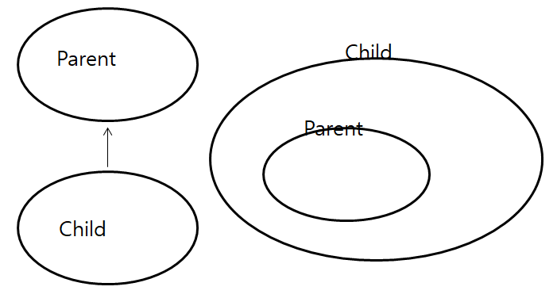

1. 상속(Inheritance)

- 기존의 클래스를 재사용하여 새로운 클래스를 작성하는 것이다.
- 코드의 재사용성을 높이고 코드의 중복을 제거하여 프로그램의 생산성과 유지보수에 기여한다.
- 새로 작성하고자 하는 클래스의 이름 뒤에 상속받을려는 클래스의 이름을 쓴다. 'extends 클래스명'

```pseudocode
조상 클래스 - 부모 클래스(parent class), 상위 클래스(super class), 기반 클래스(base class)
자손 클래스 - 자식 클래스(child class), 하위 클래스(sub class), 파생된 클래스(derived class)
```

```java
class Parent{}
class Child extands Parent{}
```



- 자손 클래스에 새로운 코드가 추가 되어도, 조상 클래스에는 아무런 영향을 미치지 않는다.
- 조상 클래스가 변경되면 자손 클래스는 자동으로 영향을 받는다.
- 자손 클래스는 조상 클래스의 모든 멤버를 상속 받으므로 항상 조상 클래스보다 같거나 많은 멤버를 갖는다.
- 생성자와 초기화 블럭은 상속되지 않는다. 오로지 멤버만 상속된다.
- 클래스 간의 관계는 오로지 부모, 자식 관계만 존재한다. 형제 관계는 없다.


2. 클래스간의 관계 -  포함(composite)관계

- 한 클래스의 멤버변수로 다른 클래스를 선언하는 것을 뜻한다.

```java
//composite
class Circle{
	Point p = new Point();
	int radius;
}

class Point{
	int x;
	int y;
}
```

```java
//inheritance 
class Circle extends Point{
	int r;
}
```

- is-a, has-a 문장을 만들어서 올바른 클래스 관계를 찾아본다.

```
 상속관계 - '~은 ~이다.'
 포함관계 - '~은 ~을 가지고 있다.'
```

```pseudocode
Circle은 Point이다
CirCle은 Point를 가지고 있다.
```

- 자바는 단일상속만 허용한다.


3. Object 클래스

- Object 클래스는 모든 클래스의 상속계층도의 가장 위에 위치하는 조상클래스이다.

- 다른 클래스를 상속받지 않은 모든 클래스는 자동적으로 'extends Object'가 붙는다.
- toString(), equals()등, 모든 인스턴스가 가져야 할 기본적인 11개의 메서드가 정의 되어 있다.


4. 오버라이딩(overriding)

- 조상클래스로 부터 상속받은 메서드의 내용을 변경 하는 것.

- 조건 --> 선언부가 일치해야한다.

  - 자손클래스에서 오버라이딩하는 조상클래스의 메서드와 이름이 같다.
  - 자손클래스에서 오버라이딩하는 조상클래스의 메서드와 매개변수가 같다.
  - 자손클래스에서 오버라이딩하는 조상클래스의 리턴타입이 같다.

  - 접근제어자와 예외처리는 제한된 조건에서 다르게 변경할 수 있다.

  ```
  1. 접근제어자는 조상클래스의 메서드보다 좁은 범위로 변경할 수 없다.
  2. 조상클래스의 메서드보다 많은 수의 예외를 선언할 수 없다. 범위도 확인 해야함.
  3. 인스턴스메서드를 static메서드 또는 그 반대로 변경할 수 없다.
  ```

- 오버로딩과 오버라이딩

```
오버로딩 - 기존에 없는 새로운 메서드를 정의하는 것(new)
오버라이딩 - 상속받은 메서드의 내용을 변경하는 것(change, modify)
```

```java
class Parent{
	void parentMethod(){}
}

class Child extends Parent{
	void parentMethod(){} //overriding
	void parentMethod(int a){} //overloading
	
	void childMethod(){}
	void childMethod(int a){} //overloading
}
```


5. super

- 자손클래스에서 조상클래스로부터 상속받은 멤버를 참조하는데 사용하는 참조변수이다.

- 조상클래스로부터 상속받은 멤버도 자손클래스 자신의 멤버이므로 this를 사용할 수 있지만, 조상클래스의 멤버와 자손클래스의 멤버가 중복 정의되어 서로 구별해야하는 경우 super를 사용하는 것이 좋다.
- super도 this와 마찬가지로 static메서드에서는 사용할 수 없고 인스턴스메서드에서만 사용할 수 있다.

```java
Class SuperTest{
	public static void main(String[] args){
		Child c = new Child();
		c.method();
 	}
}

class Parent{
	int tmp = 100;
}

class Child extands Parent{
    int tmp = 1000;
	void method(){
		System.out.println("tmp=" + tmp) //1000
		System.out.println("this.x" + this.tmp) //1000
		System.out.println("super.x"+ super.tmp)	//100
	}
}
```

- 메서드도 super를 사용하여 호출할 수 있다. 조상클래스의 메서드를 자손클래스에서 오버라이딩한 경우에 super를 사용한다.

```java
Class Point{
	int x;
	int y;
	
	String getLocation(){
		return "x: " + x +" y: " + y;
	}
}

Calss Point3D extends Point{
	int x;
	
	String getLocation(){
		return "x: " + x +" y: " + y;
		return super.getLocation() + " z: " + z;
	}
}
```


6. super()

- super()도 this()와 마찬가지로 생성자이다.
- super()는 조상클래스의 생성자를 호출하는데 사용한다.

- 자손클래스에서 인스턴스를 생성하면 자손의 멤버와 조상의 멤버가 합쳐진 하나의 인스턴스가 생성된다.
- 이 때 조상클래스 멤버의 생성과 초기화 작업을 위해 자손클래스의 생성자에서 조상클래스의 생성자가 호출되어야 한다.

- 첫 줄에서 호출해야하는데, 이유는 자손클래스의 멤버가 조상클래스의 멤버를 사용할수도 있으므로 먼저 초기화가 이루어져야 한다.

```pseudocode
Object클래스를 제외한 모든 클래스의 생성자 첫 줄에는 생성자(같은 클래스의 다른 생성자 또는 조상의 생성자)를 호출해야한다. 그렇지 않으면 컴파일러가 자동으로 'super();'를 생성자의 첫 줄에 삽입한다.
```

```java
Class Point{
	int x;
	int y;'
	
	Point(int x, int y){
		this.x = x;
		this.y = y;
	}
	
	String getLocation(){
		return "x: " + x +" y: " + y;
	}
}

Calss Point3D extends Point{
	int z;
	
	Point3D(int x, int y, int z){
		super(x, y);
		this.z = z;
	}
	
	String getLocation(){
		return super.getLocation() + " z: " + z;
	}
}
```


7. package

- package는 클래스의 묶음이며 클래스 또는 인터페이스를 포함 시킬 수 있다.

- 서로 관련된 클래스들끼리 그룹 단위로 묶어 놓으며 클래스를 효율적으로 관리할 수 있다.

- 같은 이름의 클래스도 서로 다른 패키지에 존재하는 것이 가능하므로, 자신만의 패키지 체계를 유지하면서 다른 개발자가 개발한 클래스의 라이브러리의 클래스와 이름이 충돌하는 것을 방지할 수 있다.

- 클래스가 물리적으로 하나의 클래스파일(.class)인 것과 같이 패키지는 물리적으로 하나의 디렉토리이다.

```pseudocode
package 패키지명;
package com.java.book;
- 하나의 소스파일에는 첫 번째 문장으로 단 한 번의 패키지 선언만을 허용한다.
- 모든 클래스는 반드시 하나의 패키지에 속해야한다. 
- 패키지는 점(.)을 구분자로 하여 계층구조로 구성할 수 있다.
- 패키지는 물리적으로 클래스 파일을 포함하는 하나의 디렉토리이다.
- 패키지명은 소문자로 한다.
```


8. import

- 사용하고자하는 클래스의 패키지를 import문으로 명시하면 소스코드에 사용되는 클래스이름에서 패키지명을 생략할 수 있다.
- 컴파일러에게 소스파일에 사용된 클래스의 패키지에 관한 정보를 제공하는 역할을 한다.

```pseudocode
import 패키지명.클래스명;
import 패키지명.*;

import java.util.ArrayList;
import java.util.*;
```