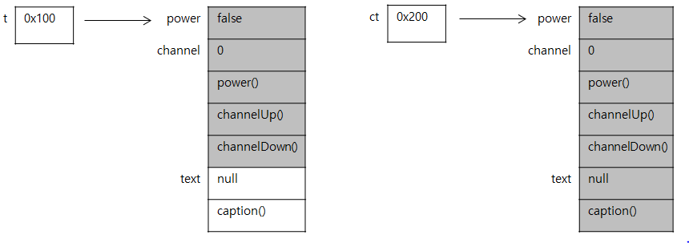

1. 다형성(polymorphism)

- 여러 가지 형태를 가질 수 있는 능력을 의미하며, 자바에서는 한 타입의 참조변수로 여러 타입의 객체를 참조할 수 있도록 함으로써 다형성을 프로그램적으로 구현했다.
- 조상클래스 타입의 참조변수로 자손클래스의 인스턴스를 참조할 수 있도록 한다.

```java
class Tv{
	boolean power;
	int channel;
	
	void power(){power = !power;}
	void channelUp(){++channel;}
	void chanelDown(){--channel;}
}

class CaptionTv extends Tv{
	String text;
	void caption(){}
}
```

- 상속관계에 있을 경우 조상클래스 타입의 참조변수로 자손 클래스의 인스턴스를 참조하도록 하는 것이 가능하다.

```java
CaptionTv ct = new CaptionTv();
Tv t = new CaptionTv();
```

- 위는 둘다 같은 타입의 인스턴스지만 참조변수의 타입에 따라 사용할 수 있는 멤버의 개수가 달라진다.



- 반대로, 자손타입의 참조변수로 조상타입의 인스턴스를 참조하는 것은 존재하지 않는 멤버를 사용하고자 할 가능성이 있으므로 허용하지 않는다. 
- 참조변수가 사용할 수 있는 멤버의 개수는 인스턴스의 멤버 개수보다 같거나 적어야 한다.

```pseudocode
- 조상타입의 참조변수로 자손타입의 인스턴스를 참조할 수 있다.
- 반대로 자손타입의 참조변수로 조상타입의 인스턴스를 참조할 수는 없다. 
```


2. 참조변수의 형변환

- 상속관계에 있는 클래스사이에서 형변환이 가능하다.
- 바로 윗 조상이나 간접적인 상속관계 경우에도 형변환이 가능하다. 따라서 모든 참조변수는 모든 클래스의 조상인 Object클래스 타입으로 형변환이 가능하다.

```
자손타입 -> 조상타입(Up-casting) : 형변환 생략가능
자손타입 <- 조상타입(Down-casting) : 형변환 생략불가
```

```java
class Car{
	String color;
	int door;
	
	void drive(){
		System.out.println("drive");
	}
	
	void stop(){
		System.out.println("stop");
	}	
}

class FireEngine extends Car{
	void water(){
		System.out.println("water");
	}
}

class Ambulance extends Car{
	void siren(){
		system.out.println("siren");
	}
}
```

```java
FireEngine f;
Ambulance a;
a = (Ambulance)f; // complie error
f = (FireEngine)a; // complie error
```

```java
Car car= null;
FireEngine fe = new FireEngine();
FireEngine fe2 = null;

car = fe; //  car = (Car)fe; 에서 형변환이 생략된 형태. Up-casting
fe2 = (FireEngine)car; // Down-casting
```

- 조상타입의 참조변수를 자손타입의 참조번수로 형변환하는 것은 참조변수가 다룰 수 있는 멤버의 개수를 늘이는 것이므로, 실제 인스턴스 멤버 개수보다 참조변수가 사용할 수 있는 멤버의 개수가 많아지므로 문제가 발생할 수 있다.
- 그래서 형변환 전에 instanceof 연산자를 사용해서 참조변수가 참조하고 있는 실제 인스턴스의 타입을 확인하는 것이 안전하다.
- 형변환은 참조변수의 타입을 변환하는 것이지 인스턴스를 변환하는 것은 아니기 떄문에 참조변수의 형변환은 인스턴스에 아무런 영향을 미치지 않는다.
- 참조변수의 형변환을 통해서, 참조하고 있는 인스턴스에서 사용할 수 있는 멤버의 범위(개수)를 조절하는 것 뿐이다.

```java
Class CastingTest{
	public static void main(String args[]){
		Car car = null;
		FireEngine fe = new FireEngine();
		FireEngine fe2 = null;
		
		fe.water();
		car = fe;
	  //car.water(); 
	  //complie error. car타입의  참조변수로는 water()를 호출할 수 없음. 
	    fe2 = (FireEngine)car;
	    fe2.water();
	}
}
```


3.  instanceof 연산자

- 참조변수가 참조하고 있는 인스턴스의 실제 타입을 알아보기 위해 instanceof 연산자를 사용한다.
- 연산의 결과로 boolean 값인 true, false 중 하나를 반환한다.

- 연산의 결과로 true를 얻었다는 것은 참조변수가 검사한 타입으로 형변환이 가능하다는 것을 뜻한다.

```java
void doWork(Car c){
	if(c instanceof FireEngine){
		FireEngine fe = (FireEngine)c;
		fe.water();
	}else if(c instanceof Ambulance){
		Ambulance a = (Ambulance) c;
		a.siren();
	}
}
```


4. 참조변수와 인스턴스의 연결

- 조상 클래스에 선언된 멤버변수와 같은 이름의 인스턴스변수를 자손 클래스에 중복으로 정의했을 때,
- 조상타입의 참조변수로 자손 인스턴스를 참조하는 경우와 자손타입의 참조변수로 자손 인스턴스를 참조하는 경우 서로 다른 결과를 가진다.

- 멤버변수가 조상 클래스와 자손 클래스에 중복으로 정의된 경우, 조상타입의 참조변수를 사용했을 때는 조상 클래스에 선언된 멤버변수가 사용되고, 자손타입의 참조변수를 사용했을 때는 자손 클래스에 선언된 멤버변수가 사용된다.
-  메서드의 경우 조상 클래스의 메서드를 자손 클래스에서 오버라이딩한 경우에도 참조변수의 타입에 관계없이 항상 실제 인스턴스의 메서드가 호출된다.

```java
class BindingTest{
	public static void main(String[] args){
		Parent p = new Child();
		Child c = new Child();
		
		system.out.println("p.x = " +p.x);
		p.method();
		
		System.out.println("c.x = " +c.x);
		c.method();
	}
}

class Parent{
	int x = 100;
	
	void method(){
		System.out.println("Parent Method");
	}
}

class Child extends Parent{
	int x = 200;
	void method(){
		System.out.println("Child Method");
	}
}

p.x =100
Child Method
c.x =200
Child Method
```


5. 매개변수의 다형성

```java
class Product{
	int price;
	int bonusPoint;
}

calss Tv extends Product{}
class Computer extends Prodect{}
class Audio extends Product{}

class Buyer{
	int money = 100;
	int bonusPoint = 1;
    
//    void buy(Tv t){
//        	money = money - t.price;
//        	bonusPoint = bonusPoint + t.bonusPoint;
//    }
    
//    void buy(Computer c){
//        	money = money - c.price;
//        	bonusPoint = bonusPoint + c.bonusPoint;
//    }

    void buy(Product p){
        money = money - p.price;
        bonusPoint = bonusPoint + p.bonusPoint;
    }
}
```

- 메서드의 매개변수에 다형성을 적용하면 하나의 메서드로 간단히 작성할 수 있다.


6. 여러 종류의 객체를 하나의 배열로 다루기

- 조상타입의 참조변수로 자손타입의 객체를 참조하는 것이 가능하다.
- 조상타입의 참조변수 배열을 사용하면, 공통의 조상을 가진 서로 다른 종류의 객체를 배열로 묶어서 다룰 수 있다.

```java
class Buyer{
	int money = 100;
	int bonusPoint = 10;
	Product[]tmp = new Product[10];
	int i = 0;
	
	void buy(Product p){
		if(money <p.price){
			System.out.println("잔액부족");
			return;
		}
		
		money -= p.price;
		bonusPoint += p.bonusPoint;
		tmp[i++] = p;
		System.out.println(p +"를 구입했음.");
	}
}
```


7. Vector 클래스

- Vector 클래스는 내부적으로 Object타입의 배열을 가지고 있어서, 이 배열에 객체를 추가하거나 제거할 수 있게 작성되어 있다.
- 배열의 크기를 알아서 관리해주므로 위의 일반 배열과는 달리 인스턴스의 개수에 신경쓰지 않아도 된다.

```java
import java.util.*;

class Buyer{
	int money = 100;
	int bonusPoint = 10;
	Vector tmp = new Vector();
    
	void buy(Product p){
		if(money <p.price){
			System.out.println("잔액부족");
			return;
		}
		
		money -= p.price;
		bonusPoint += p.bonusPoint;
		tmp.add(p);
		System.out.println(p +"를 구입했음.");
	}
}
```

