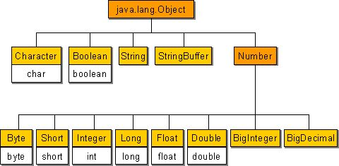

5. wrapper클래스

5-1. wrapper클래스

- 기본형 변수도 객체로 다주어져야 하는 경우가 있다.
- 예를 들면, 매개변수로 객체를 요구할 때, 기본형 값이 아닌 객체로 저장해야 할 때, 객체간의 비교가 필요할 때 등의 경우에는 기본형 값들을 객체로 변환하여 작업을 수행해야 한다.
- 8개의 기본형을 대표하는 8개의 wrapper클래스가 있는데, 이 클래스를 이용하면 기본형 값을 객체로 다룰 수 있다.
- wrapper클래스의 생성자는 매개변수로 문자열이나 각 자료형의 값들을 인자로 받는다. 이 때 주의해야할 것은 생성자의 매개변수로 문자열을 제공할 때, 각 자료형에 알맞는 문자열을 사용해야 한다는 것이다. 
- 예를 들면, new Integer("1.0");과 같은 코드는 NumberFormatException이 발생한다.
- 아래의 코드는 int형의 wrapper클래스인 Integer클래스의 실제 코드이다.

```java
public final class Integer extends Number implements Comparable{
	...
	private int value;
	...
}
```

- wrapper클래스들은 객체생성 시, 생성자의 인자로 주어진 각 자료형에 알맞는 값을 내부적으로 저장하고 있으며, 이에 관련된 여러 메서드가 정의되어 있다.

```
기본형 : boolean
래퍼클래스 : Boolean
생성자 : Boolean(boolean value)
		Boolean(String s)

예시 : Boolean b = new Boolean(true);
	  Boolean b2 = new Boolean("true");
```

```
기본형 : char
래퍼클래스 : Character
생성자 : Character(char value)

예시 : Character b = new Character('a');
```

```
기본형 : byte
래퍼클래스 : Byte
생성자 : Byte(byte value)
		Byte(String s)

예시 : Byte b = new Byte(10);
	  Byte b2 = new Byte("10");
```

```
기본형 : short
래퍼클래스 : Short
생성자 : Short(short value)
		Short(String s)

예시 : Short b = new Short(10);
	  Short b2 = new Short("10");
```

```
기본형 : int
래퍼클래스 : Integer
생성자 : Integer(int value)
		Integer(String s)

예시 : Integer b = new Integer(10);
	  Integer b2 = new Integer("10");
```

```
기본형 : long
래퍼클래스 : Long
생성자 : Long(long value)
		Long(String s)

예시 : Long b = new Long(10);
	  Long b2 = new Long("10");
```

```
기본형 : float
래퍼클래스 : Float
생성자 : Float(doulbe value)
		Float(float value)
		Float(String s)

예시 : Float b = new Float(10.0);
	  Float b2 = new Float(10.0f)
	  Float b3 = new Float("10.0f");
```

```
기본형 : double
래퍼클래스 : Double
생성자 : Double(doulbe value)
		Double(String s)

예시 : Double b = new Double(10.0);
	  Double b2 = new Double("10.0");
```

```java
class Test {
	public static void main(String[] args) {
		Integer i = new Integer(100);
		Integer i2 = new Integer(100);
		
		System.out.println("i==i2 ? "+(i==i2));
		System.out.println("i.equals(i2) ? "+i.equals(i2));
		System.out.println("i.toString()="+i.toString());
		
		System.out.println("MAX_VALUE="+Integer.MAX_VALUE);
		System.out.println("MIN_VALUE="+Integer.MIN_VALUE);
		System.out.println("SIZE="+Integer.SIZE+"bits");
		System.out.println("TYPE="+Integer.TYPE);

	}
}

i==i2 ? false
i.equals(i2) ? true
i.toString()=100
MAX_VALUE=2147483647
MIN_VALUE=-2147483648
SIZE=32bits
TYPE=int
```

- wrapper클래스들은 모두 equals()가 오버라이딩되어 있어서 주소값이 아닌 객체가 가지고 있는 값을 비교한다.
- toString()도 오버라이딩 되어 있어서 객체가 가지고 있는 값을 문자열로 변환하여 반환한다.


```java
class Test {
	public static void main(String[] args) {
		int i = new Integer("100").intValue();
		int i2 = Integer.parseInt("100");
		Integer i3 = Integer.valueOf("100");
		int i4 = Integer.parseInt("100",2);
		int i5 = Integer.parseInt("100",8);
		int i6 = Integer.parseInt("100", 16);
		int i7 = Integer.parseInt("FF", 16);
//		int i8 = Integer.parseInt("FF"); //NumberFormatException 발생
		
		Integer i9 = Integer.valueOf("100", 2);
		Integer i10 = Integer.valueOf("100", 8);
		Integer i11 = Integer.valueOf("100", 16);
		Integer i12 = Integer.valueOf("FF", 16);
//		Integer i13 = Integer.valueOf("FF"); //NumberFormatException 발새
		
		System.out.println(i);
		System.out.println(i2);
		System.out.println(i3);
		System.out.println("100(2) "+ i4);
		System.out.println("100(8) "+i5);
		System.out.println("100(16) "+i6);
		System.out.println("FF(16) "+i7);
		
		System.out.println("100(2) "+i9);
		System.out.println("100(8) "+i10);
		System.out.println("100(16) "+i11);
		System.out.println("FF(16) "+i12);
		
	

	}
}

100
100
100
100(2) 4
100(8) 64
100(16) 256
FF(16) 255
100(2) 4
100(8) 64
100(16) 256
FF(16) 255
```

- 문자열을 숫자로 변환하는 방법은 아래 중 하나를 선택해서 사용하면 된다.

```java
int i = new Integer("100").intValue(); //floatvlaue(), longValue(), ...
int i2 = Integer.parseInt("100");
Integer i3 = Integer.valueOf("100");
```

```java
문자열 -> 기본형
byte b = Byte.parseByte("100");
short s = Short.parseShort("100");
int i = Integer.parseInt("100");
long l = Long.parseLong("100");
float f = Float.parseFloat("3.14");
double d = Double.parseDouble("3.14");
```

```java
문자열 -> wrapper클래스
Byte b = Byte.valueOf("100");
Short s = Short.valueOf("100");
Integer i = Integer.valueOf("100");
Long l = Long.valueOf("100");
Float f = Float.valueOf("3.14");
Double d = Double.valueOf("3.14");
```

- JDK 1.5부터 도입된 오토박싱(autoboxing)기능 떄문에 반환값이 기본형 일 때와 wrapper클래스 일때의 차이가 없어졌다. 단 성능을 비교하면 valueOf()가 조금 더 느리다.


5-2. Number클래스

- Number클래스는 추상클래스로 내부적으로 숫자를 멤버변수로 갖는 클래스들의 조상이다.



- BigInteger는 long으로도 다룰 수 없는 큰 범위의 정수를, BigDecimal은 double로도 다룰 수 없는 큰 범위의 부동 소수점수를 처리하기 위한 것이다.