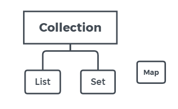
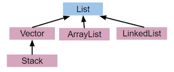
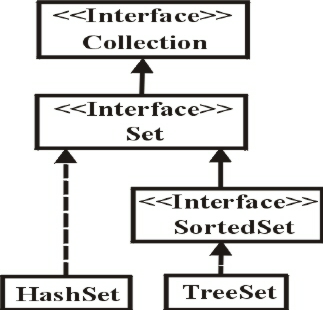
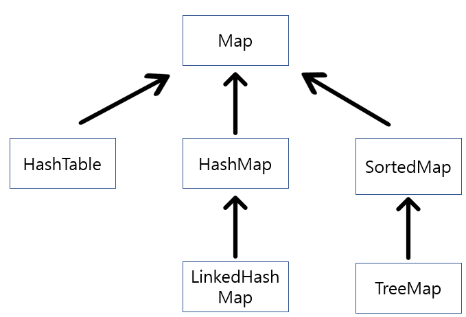

- 자바에서는 많은 수의 다양한 패키지(Java API)를 제공하여 개발자들이 자바 어플리케이션을 쉽게 개발할 수 있도록 도와준다.
- 일반적인 프로그래밍에 필요한 기능의 클래스들은 대부분 여기에 포함되어 있기 때문에 개발 전에 원하는 기능을 가진 클래스가 존재하는지 찾아보는 것이 좋다.
- 이 장에서는 java.util패키지를 중심으로 실제 프로그래밍에 자주 사용되는 클래스들을 골라서 아래와 같이 세가지 그룹으로 나누어 설명한다.

```
1. 컬렉션 프레임워크(Collection Framework) : 다수의 데이터를 쉽게 처리할 수 있는 표준화된 방법을 제공하는 클래스들
2. 유용한 클래스 : 알아두면 좋은 자주 쓰이는 클래스들
3. 형식화 클래스 : 데이터를 표준화된 형식으로 출력하는데 도움을 주는 클래스들
```


1. Collection Framework

- 컬렉션 프레임워크란 '데이터 군을 저장하는(Vector와 같은)클래스들을 표준화한 설계'를 뜻한다.
- 컬렉션은 다수의 데이터, 즉 데이터 그룹을 뜻한다.
- 프레임워크는 표준화된 프로그래밍 방식을 의미한다.


1-1. 컬렉션 프레임워크의 핵심 인터페이스 - List, Set, Map

- 컬렉션 프레임워크에서는 컬렉션을 크게 3가지 타입이 존재한다고 인식하고 각 컬렉션을 다루는데 필요한 기능을 가진 3개의 인터페이스를 정의했다.
- 그리고 인터페이스 List와 Set의 공통된 부븐을 다시 뽑아서 Collection인터페이스를 추가로 정의했다.

- 인터페이스 List와 Set을 구현한 컬렉션 클래스들은 서로 많은 공통부분이 있어서, 공통된 부분을 다시 뽑아 Collection 인터페이스를 정의할 수 있었다.
- 인터페이스 Map은 이들과는 전혀 다른 형태로 컬렉션을 다루기 때문에 같은 상속계층도에 포함되지 못했다.



```
인터페이스 : List
특징 : 순서가 있는 데이터의 집합. 데이터의 중복을 허용한다.
구현클래스 : ArrayList, LinkedList, Stack, Vector 등
```

```
인터페이스 : Set
특징 : 순서를 유지하지 않는 데이터의 집합. 데이터의 중복을 허용하지 않는다.
구현클래스 : HashSet, TreeSet 등
```

```
인터페이스 : Map
특징 : 키(key)와 값(value)의 쌍(pair)으로 이루어진 데이터의 집합. 
	  순서는 유지되지 않으며, 키는 중복을 허용하지 않고 값은 중복을 허용한다.
구현클래스 : HashMap, TreeMap, Hashtable, Properties 등	  
```

- 실제 개발 시에는 다루고자 하는 컬렉션의 특징을 파악하고 어떤 인터페이스를 구현한 컬렉션 클래스를 사용해야 하는지 결정해야 한다.
- 컬렉션 프레임워크의 모든 컬렉션 클래스들은 List, Set, Map 중의 하나를 구현하고 있으며, 구현한 인터페이스의 이름이 클래스의 이름에 포함되어있어서 이름만으로도 클래스의 특징을 쉽게 알 수 있도록 되어있다.
- 그러나 Vector, Stack, Hashtable, Properties와 같은 클래스들은 컬렉션 프레임워크가 만들어지기 이전부터 존재하던 것이기 때문에 컬렉션 프레임워크의 명명법을 따르지 않는다.
- Vector이나 Hashtable과 같은 기존의 컬렉션 클래스들은 호환을 위해, 설계를 변경해서 남겨두었지만 가능하면 사용하지 않는 것이 좋다. 그 대신 새로 추가된 ArrayList와 HashMap을 사용하자.


1-1-1. Collection인터페이스

```
메서드 : boolean add(Object o)
		booelan addAll(Collection c)
		
설명 : 지정된 객체(o) 또는 Collection(c)의 객체들을 Collection에 추가한다.
```

```
메서드 : void clear()

설명 : Collection의 모든 객체를 삭제한다.
```

```
메서드 : boolean contains(Object o)
		boolean containsAll(Collection c)
		
설명 : 지정된 객체(o) 또는 Collection의 객체들이 Collection에 포함되어 있는지 확인한다.
```

```
메서드 : boolean equals(Object o)

설명 : 동일한 Collection인지 비교한다.
```

```
메서드 : int hashCode()

설명 : Collection의 hash code를 반환한다.
```

```
메서드 : boolean isEmpty()

설명 : Collection이 비어있는지를 확인한다.
```

```
메서드 : Iterator iterator()

설명 : Collection의 Iterator를 얻어서 반환한다.

*Iterator는 자바의 컬렉션프레임워크에서 컬렉션에 저장되어 있는 요소들을 읽어오는 방법을 표준화한 것이다.
```

```
메서드 : boolean remove(Object o)

설명 : 지정된 객체를 삭제한다.
```

```
메서드 : boolean removeAll(Collection c)

설명 : 지정된 Collecion에 포함된 객체들을 삭제한다.
```

```
메서드 : boolean retainAll(Collection c)

설명 : 지정된 Collection에 포함된 객체만을 남기고 다른 객체들은 Collection에서 삭제한다.
	  이 작업으로 인해 Collection에 변화가 있으면 true, 변화가 없으면 false를 반환한다.
```

```
메서드 : int size()

설명 : Collection에 저장된 객체의 개수를 반환한다.
```

```
메서드 : Object[] toArray()

설명 : Collection에 저장된 객체를 객체배열(Object[])로 반환한다.
```

```
메서드 : Object[] toArray(Object[] a)

설명 : 지정된 배열에 Collection의 객체를 저장해서 반환한다.
```

- Collection인터페이스는 컬렉션 클래스에 저장된 데이터를 읽고, 추가하고 삭제하는 등 컬렉션(데이터 군)을 다루는데 가장 기본적인 메서드들을 정의하고 있다.


1-1-2. List인터페이스

- List인터페이스는 중복을 허용하면서 저장순위가 유지되는 컬렉션을 구현하는데 사용된다. 
- List인터페이스를 구현한 클래스는 ArrayList, LinkedList, Vector, Stack 등이 있다.



```
void add(int idx, Object element)
boolean addAll(int idx, Collection c)

지정된 위치(idx)에 객체(element) 또는 컬렉션에 포함된 객체들을 추가한다.
```

```
Object get(int idx)

지정된 위치(idx)에 있는 객체를 반환한다.
```

```
int indexOf(Object o)

지정된 객체의 위치(index)를 반환한다.(List의 첫 번째 요소부터 순방향으로 찾는다.)
```

```
int lastIndexOf(Object o)

지정된 객체의 위치를 반환한다.(List의 마지막 요소부터 역방향으로 찾는다.)
```

```
ListIterator listIterator()
ListIterator listIterator(int idx)

List의 객체에 접근할 수 있는 ListIterator를 반환한다.
```

```
Object remove(int idx)

지정된 위치에 있는 객체를 삭제하고 삭제된 객체를 반환한다.
```

```
Object set(int idx, Object element)

지정된 위치에 객체를 저장한다.
```

```
List subList(int fromIndex, int toIndex)

지정된 범위(fromIndex부터 toIndex)에 있는 객체를 반환한다.
```


1-1-3. Set인터페이스

- Set인터페이스는 중복을 허용하지 않고 저장순위가 유지되지 않는 컬렉션 클래스를 구현하는데 사용된다.
- Set인터페이스를 구현한 클래스로는 HashSet, TreeSet 등이 있다.




1-1-4. Map인터페이스

- Map인터페이스는 키와 값을 하나의 쌍으로 묶어서 저장하는 컬렉션 클래스를 구현하는데 사용된다.
- 키는 중복될 수 없지만 값은 중복을 허용한다.
- 기존에 저장된 데이터와 중복된 키와 값을 저장하면 기존의 값은 없어지고 마지막에 저장된 값이 남게 된다.
- Map인터페이스를 구현한 클래스로는 Hashtable, hashMap, LinkedHashMap, SortedMap, TreeMap 등이 있다.



```
void clear()

Map의 모든 객체를 삭제한다.
```

```
boolean containsKey(Object key)

지정된 key객체와 일치하는 Map의 key객체가 있는지 확인한다.
```

```
boolean containsValue(Object value)

지정된 value객체와 일치하는 Map의 value객체가 있는지 확인한다.
```

```
Set entrySet()

Map에 저장되어 있는 key-value쌍을 Map.Entry타입의 객체로 저장한 Set으로 반환한ㄷ.
```

```
boolean equals(Object o)

동일한 Map인지 비교한다.
```

```
Object get(Object key)

지정한 key객체에 대응하는 value객체를 찾아서 반환한다.
```

```
int hashCode()

해시코드를 반환한다.
```

```
boolean isEmpty()

Map이 비어있는지 확인한다.
```

```
Set keySet()

Map에 저장된 모든 key객체를 반환한다.
```

```
Object put(Object key, Object value)

Map에 value객체를 key객체에 연결(mapping)하여 저장한다.
```

```
void putAll(Map t)

지정된 Map의 모든 key-value쌍을 추가한다.
```

```
Object remove(Object key)

지정한 key객체와 일치하는 key-value객체를 삭제한다.
```

```
int size()

Map에 저장된 key-value쌍의 개수를 반환한다.
```

```
Collection values()

Map에 저장된 모든 value객체를 반환한다.
```

- values에서는 반환타입이 Collection이고, keySet()에서는 반환타입이 Set이다.
- Map인터페이스에서는 값은 중복을 허용하기 때문에 Collection타입으로 반환하고 key는 중복을 허용하지 않기 때문에 Set타입으로 반환한다.


1-1-5. Map.Entry인터페이스

- Map.Entry인터페이스는 Map인터페이스의 내부 인터페이스이다.
- 내부 클래스와 같이 인터페이도 인터페이스 안에 인터페이스를 정의하는 내부 인터페이스를 정의하는 것이 가능하다.
- Map에 저장되는 key-value쌍을 다루기 위해 내부적으로 Entry인터페이스를 정의해 놓았다.
- Map인터페이스를 구현하는 클래스에서는 Map.Entry인터페이스도 함게 구현해야한다.

```
자바 공식 문서에서는 키와 값으로 구성되는 데이터를 매핑(mapping) 또는 엔트리(entry)라고 기술하고 있다.
```

```java
public interface Map{
	...
	interface Entry{
		Object getKey();
		Object getValue();
		Object setValue(Object value);
		boolean equals(Object o);
		int hashCode();
	}
}
```

```
boolean equals(Object o)

동일한 Map인지 비교한다.
```

```
Object getKey()

Entry의 key객체를 반환한다.
```

```
Object getValue()

Enrty의 value객체를 반환한다.
```

```
int hashCode()

Entry의 해시코드를 반환한다.
```

```
Object setValue(Object value)

Entry의 value객체를 지정된 객체로 바꾼다.
```


1-2. 동기화(Synchronization)

- 멀티쓰레드 프로그래밍에서는 하나의 객체를 여러 쓰레드가 동시에 접근할 수 있기 때문에 데이터의 일관성(consistency)을 유지하기 위해서는 동기화가 필요하다.
- Vector와 Hashtable과 같은 구버전의 클래스들은 자체적으로 동기화 처리가 되어 있는데, 멀티쓰레드 프로그래밍이 아닌 경우에는 불필요한 기능이 되어 성능을 떨어뜨리는 요인이 된다.
- 새로 추가된 ArrayList와 HashMap과 같은 컬렉션은 동기화를 자체적으로 처리하지 않고 필요한 경우에만 java.util.Colletions클래스의 동기화 메서드를 이용해서 동기화처리가 가능하도록 변경했다.
- Collections클래스에는 다음과 같은 동기화 메서드를 제공하고 있으므로, 동기화가 필요할 때 해당하는 것을 사용하면 된다.

```java
static Collection synchronizedCollection(Collection c)
static List synchronizedList(List list)
static Map synchronizedMap(Map m)
static Set synchronizedSet(Set s)
static SortedMap synchronizedSortedMap(SortedMap m)
static SortedSet synchronizedSortedSet(SortedSet s)
```

```java
List list = collections.synchronizedList(new ArrayList(...));
```


